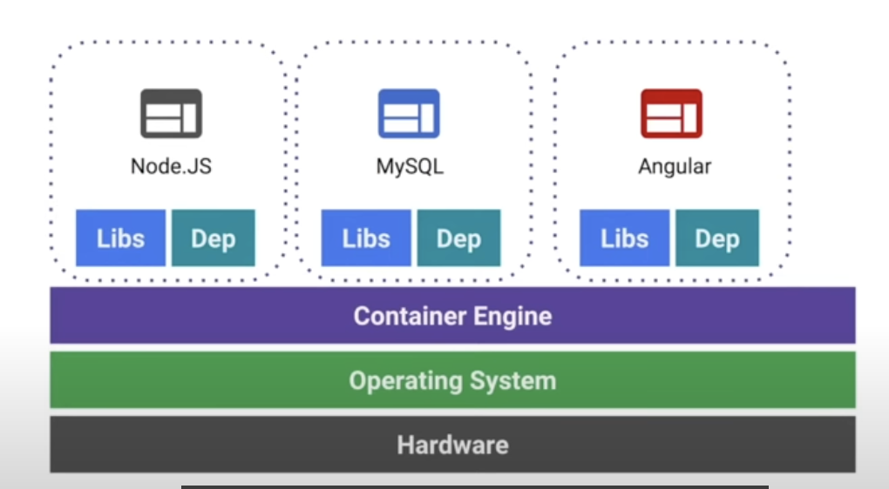

A container is a group of processes that are isolated from the host system and other containers. Containers share the same kernel as the host system, but they have their own filesystem, network stack, and process space. This allows containers to run on any system that has a compatible container engine installed. 
This makes it easy to move the contained application between environments (dev, test, production, etc.) while retaining full functionality.

The container engine could be Docker, Podman, or any other container engine. 

- Docker is the most popular container engine and is widely used in the industry.
- Podman is a newer container engine that is designed to be a drop-in replacement for Docker, with some additional features such as rootless containers and better security. Podman is also compatible with Docker commands, so you can use it as a replacement for Docker without having to learn a new set of commands.
- Other container engines include containerd, rkt, and LXC/LXD. These engines are less commonly used but may be preferred in certain situations.

